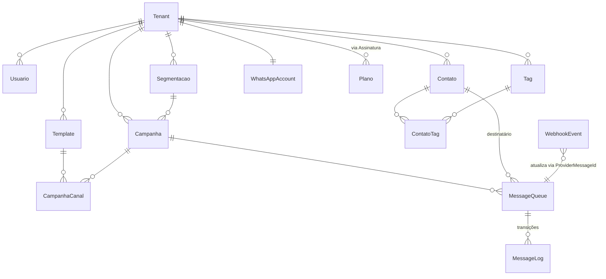
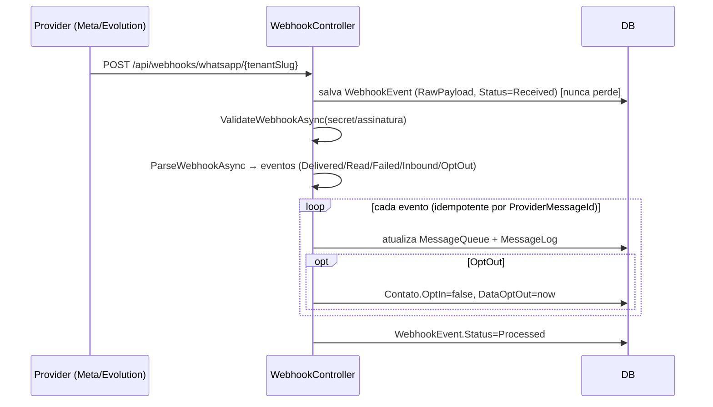

# WhatsFlow — Etapa 2: Planejamento Técnico

> Base: `/Users/aurelioromeu/repos/AppIgreja` · Destino: `/Users/aurelioromeu/repos/Malach/WhatsFlow`
> Decisões travadas: **.NET 10** · **Fila em banco + Worker** · **`apps/{api,worker,admin}` + `libs/`**
> Ainda é planejamento — **nenhum código de projeto foi criado/alterado**.

---

## 1. ADRs (decisões de arquitetura)

### ADR-01 — Reaproveitar o núcleo do AppIgreja por **fork seletivo**
Copiamos só o núcleo SaaS+WhatsApp, renomeamos `SistemaIgreja*→WhatsFlow*` e podamos o domínio de
igreja. AppIgreja fica **somente leitura**. WhatsFlow nasce com **git limpo**.
**Consequência:** evitamos reescrever auth/tenancy/worker/Evolution já testados.

### ADR-02 — Fila de mensagens em **PostgreSQL**, processada pelo Worker
Reusamos o padrão `ComunicacaoEntrega` (status `Pendente→Reservado→Enviado→Entregue/Falhou`), que já é
uma fila transacional com reserva de item. Sem Redis/Hangfire no MVP.
**Quando escalar:** lock distribuído via `pg_advisory_lock` (ou Redis) ao rodar +1 instância de Worker.
**Consequência:** menos infra; um ponto a vigiar é throughput de polling (configurável).

### ADR-03 — Provider de WhatsApp desacoplado em **duas camadas**
- **`IComunicacaoCanalProvider`** (já existe): o seam que o Worker usa para despachar uma `Entrega`,
  agnóstico de canal (WhatsApp/Email/Interno).
- **`IWhatsAppProvider`** (novo): provider específico de WhatsApp, injetado dentro do canal WhatsApp.
  Implementações: **`FakeWhatsAppProvider`** (dev/testes), **`EvolutionWhatsAppProvider`** (já funciona),
  **`CloudApiWhatsAppProvider`** (preparado p/ Meta oficial).
A regra de negócio (campanha, fila) nunca referencia um provider concreto.
**Consequência:** trocar/!adicionar provider = nova classe + registro DI, sem tocar no domínio.

### ADR-04 — TFM **.NET 10** em toda a solução (sem downgrade).

### ADR-05 — **Uma migration inicial** (`InitialCreate`), não as 132 do AppIgreja
Geramos um schema novo a partir do modelo já podado. As 132 migrations carregam tabelas de igreja e não
agregam ao WhatsFlow.
**Consequência:** histórico limpo; perde-se o "histórico" de migrations da base (irrelevante para produto novo).

### ADR-06 — Schedulers **somente no Worker** (corrige envio duplicado apontado no SAAS_READINESS).

### ADR-07 — Segredos de provider **cifrados em repouso** (`AccessToken`, `WebhookSecret`) e refresh tokens em tabela (não em memória).

---

## 2. Interface `IWhatsAppProvider` (contrato conceitual)

```csharp
public interface IWhatsAppProvider
{
    WhatsAppProviderType Type { get; }            // EvolutionApi | OfficialCloudApi | Twilio | Zenvia | Fake

    Task<ProviderSendResult> SendTextMessageAsync(
        WhatsAppAccount account, string toPhoneE164, string body, CancellationToken ct = default);

    Task<ProviderSendResult> SendTemplateMessageAsync(
        WhatsAppAccount account, string toPhoneE164,
        string providerTemplateRef, IDictionary<string,string> variables, CancellationToken ct = default);

    Task<ProviderMessageStatus?> GetMessageStatusAsync(
        WhatsAppAccount account, string providerMessageId, CancellationToken ct = default); // opcional

    Task<bool> ValidateWebhookAsync(WebhookContext ctx, CancellationToken ct = default);

    Task<IReadOnlyList<WebhookMessageEvent>> ParseWebhookAsync(WebhookContext ctx, CancellationToken ct = default);
}

public record ProviderSendResult(bool Success, string? ProviderMessageId, string? ErrorCode, string? ErrorMessage);
public record WebhookMessageEvent(string ProviderMessageId, MessageEventType Type, DateTime OccurredAt, string? Detail);
// MessageEventType: Sent | Delivered | Read | Failed | Inbound | OptOut
```

`FakeWhatsAppProvider`: gera `ProviderMessageId` simulado, sempre `Success`, e (opcional) dispara eventos
de status fake para testar o fluxo de webhook localmente.

---

## 3. Modelo de dados alvo

### 3.1 Entidades e origem

| WhatsFlow | Origem | Ação |
|---|---|---|
| `Tenant` | `Tenant` | **estender** (campos da spec) |
| `Usuario` | `Usuario` | reusar |
| `PerfilAcesso` + `PerfilAcessoPermissao` | idem | reusar + **seed 4 perfis** |
| `Contato` | redefinir (ideias de `Pessoa`) | **novo** (campos da spec) |
| `Tag` | — | **novo** |
| `ContatoTag` | — | **novo** (N:N) |
| `Template` | `ComunicacaoTemplate` | estender (Categoria, ProviderTemplateId, Status spec) |
| `Campanha` | `ComunicacaoCampanha` | estender (contadores, SegmentacaoId) |
| `CampanhaCanal` | `ComunicacaoCampanhaCanal` | reusar (liga template↔campanha) |
| `Segmentacao` | `ComunicacaoSegmento` | estender (regras de filtro em JSON) |
| `MessageQueue` (Entrega) | `ComunicacaoEntrega` | estender (ProviderMessageId, ReadAt, ScheduledTo, ErrorCode, UpdatedAt; destinatário→`Contato`) |
| `MessageLog` | — | **novo** (histórico append-only de status) |
| `WhatsAppAccount` | parte de `ConfiguracaoMensagem`/`EvolutionApiSettings` | **novo** (config por tenant) |
| `WebhookEvent` | — | **novo** (evento bruto + processamento) |
| `AuditLog` | `AuditLog` | reusar (1:1 com a spec) |
| `Plano` + `Assinatura` | idem | reusar |

### 3.2 Campos novos/estendidos relevantes

**`Tenant`** (+): `Documento`, `Email`, `Telefone`, `Status` (enum `Active|Inactive|Suspended`, substitui `bool Ativo`),
`PlanoId`, `LimiteMensalMensagens`, `LimiteContatos`, `FusoHorario` (default `America/Sao_Paulo`), `DataAtualizacao`.

**`Contato`** (novo): `Id, TenantId, Nome, TelefoneWhatsApp (E.164), Email?, Documento?, Organizacao?,
Observacoes?, Origem?, Status (Active|Inactive|Blocked), OptIn (bool), DataOptIn?, DataOptOut?,
CriadoEm, AtualizadoEm` + N:N `Tags`. **Índice único `(TenantId, TelefoneWhatsApp)`**.

**`Template`** (+): `Categoria`, `ProviderTemplateId?`; `Status` → `Draft|PendingApproval|Approved|Rejected|Archived`
(estende o atual `Rascunho|Ativo|Arquivado`). Já tem `Versao`, `VariaveisPermitidas`.

**`Campanha`** (+): `TemplateId`, `SegmentacaoId?`, `TotalDestinatarios, TotalEnviadas, TotalFalhas,
TotalEntregues, TotalLidas`. Já tem `Status` (mapeia p/ `Draft|Scheduled|Running|Paused|Finished|Canceled|Failed`),
`DataAgendamento`.

**`MessageQueue`** (+): `ProviderMessageId?`, `ErrorCode?`, `ReadAt?`, `ScheduledTo?`, `AtualizadoEm`.
Já tem `Status`, `Tentativas`(=RetryCount), `ProcessadoEm`(≈SentAt), `EntregueEm`, `Erro`, `DestinoResolvido`(=PhoneNumber),
`ConteudoFinal`(=MessageBody), `ChaveDedupe`.

**`WhatsAppAccount`** (novo): `TenantId, Provider (enum), PhoneNumberId, BusinessAccountId, AccessTokenCifrado,
WebhookSecret, Status, ConfigJson, CriadoEm, AtualizadoEm`.

**`WebhookEvent`** (novo): `TenantId, Provider, EventType, RawPayload (jsonb), ProviderMessageId?, Status
(Received|Processed|Failed), Error?, ProcessedAt?, CreatedAt`.

### 3.3 Diagrama ER (resumo)



Toda entidade operacional implementa `ITenantEntity` → query filter global + carimbo no `SaveChanges`.
Globais (sem TenantId): `Tenant`, `TenantDomain`, `Plano`, `WebhookEvent`? → **WebhookEvent terá TenantId**
(resolvido pela conta/PhoneNumberId), para não vazar entre tenants.

---

## 4. Fluxos

### 4.1 Envio (Worker)
```mermaid
sequenceDiagram
    participant W as Worker (poll)
    participant DB as Postgres (MessageQueue)
    participant P as IWhatsAppProvider
    W->>DB: SELECT itens Pendente (limit N) + reserva (Reservado)
    loop cada item
        W->>P: SendText/SendTemplate(account, phone, ...)
        P-->>W: ProviderSendResult(MessageId | erro)
        alt sucesso
            W->>DB: Status=Enviado, ProviderMessageId, SentAt; +MessageLog
        else falha
            W->>DB: Tentativas++; se < max → volta Pendente (backoff); senão Falhou (+ErrorCode/Erro)
        end
    end
    Note over W,DB: respeita rate limit do provider e LimiteMensalMensagens do plano
```

### 4.2 Campanha
```mermaid
sequenceDiagram
    actor U as Gestor
    participant API
    participant DB
    participant W as Worker
    U->>API: Iniciar campanha
    API->>API: valida Template=Approved + WhatsAppAccount ativa
    API->>DB: resolve Segmentação → Contatos elegíveis (OptIn=true, Status=Active)
    API->>DB: cria MessageQueue (1 por destinatário) Status=Pendente; Campanha=Running; TotalDestinatarios
    Note over API,DB: pausar/cancelar/retomar = update de status (itens Pendentes respeitam pausa)
    W->>DB: processa fila (fluxo 4.1) e atualiza contadores da campanha
```

### 4.3 Webhook


---

## 5. Estrutura de pastas final

```
WhatsFlow/
├─ apps/
│  ├─ api/      WhatsFlow.Api            (host Web API)
│  ├─ worker/   WhatsFlow.Worker         (host background)
│  └─ admin/    React SPA (Vite)         (ex-FrontEnd)
├─ libs/
│  ├─ WhatsFlow.Domain
│  ├─ WhatsFlow.Application
│  └─ WhatsFlow.Infrastructure
├─ tests/WhatsFlow.Tests
├─ docker/   (Dockerfile.api, Dockerfile.worker, Dockerfile.admin)
├─ docs/
├─ WhatsFlow.sln
└─ docker-compose.yml
```
Referências: `Api → Application, Infrastructure`; `Worker → Application, Infrastructure`;
`Infrastructure → Application, Domain`; `Application → Domain`.

---

## 6. Mapa de renome (`SistemaIgreja* → WhatsFlow*`)

| De | Para |
|---|---|
| `SistemaIgreja.API` | `WhatsFlow.Api` |
| `SistemaIgreja.Application` | `WhatsFlow.Application` |
| `SistemaIgreja.Domain` | `WhatsFlow.Domain` |
| `SistemaIgreja.Infrastructure` | `WhatsFlow.Infrastructure` |
| `SistemaIgreja.BackgroundWorker` | `WhatsFlow.Worker` |
| `SistemaIgrejaDbContext` | `WhatsFlowDbContext` |
| `SistemaIgreja.sln` | `WhatsFlow.sln` |
| namespace/`using SistemaIgreja.*` | `WhatsFlow.*` |
| domínio `Comunicacao*` (Template/Campanha/Entrega/Segmento/...) | `Template/Campanha/MessageQueue/Segmentacao` |
| tema front `verbo`, `app.name=Verbo+` | `whatsflow`, `WhatsFlow` |

Renome é mecânico (find/replace por projeto) + **compilar ao final** de cada projeto.

---

## 7. Poda — lista nominal do que será removido

**Entidades (Domain):** Cargo, CategoriaDespesa, CategoriaMidia, CategoriaNoticia, CategoriaPatrimonio,
CategoriaReceita, CentroCusto, ConfiguracaoCampanhaAniversario, ConfiguracaoPortal, ConsentimentoRegistro,
ContaBancaria, CriancaDetalhe, Despesa, DestaqueSite, DoacaoOnline, Enquete(+Opcao/Voto),
EnvioCampanhaAniversario, Equipe, Escala(+Item/Modelo/ModeloItem), Evento(+Ocorrencia/Recorrencia),
FinalidadeDoacao, Fornecedor, GaleriaFoto(+Item), GivingProviderConfig, HubCasa, IndisponibilidadeVoluntario,
InscricaoEvento, Kids* (todas), Noticia, OrcamentoCategoria, PatrimonioItem(+Movimentacao), PerfilPessoa,
Pessoa, PessoaPerfil, Projeto, Receita, ResponsavelCrianca, SolicitacaoTitular, SolicitacaoTrocaEscala,
Visitante, Voluntario. **Manter `MensagemAgendada`/`NotificacaoUsuario`?** → avaliar: úteis como base de
agendamento/notificação interna; decisão na Etapa 3 (provável manter `MensagemAgendada` como apoio ao scheduler).

**Controllers / Services / páginas front** correspondentes às entidades acima.

**Manter:** Auth, Tenants, Usuarios, PerfisAcesso, AuditLogs, Dashboard, Comunicacao* (→ renomeado),
ConfiguracoesMensagens (→ WhatsAppAccount), Webhooks, Billing/Signup, Search, Upload.

> ⚠️ Nenhuma remoção é feita sem essa lista validada por você (regra de não quebrar nada silenciosamente).

---

## 8. RBAC — recursos e perfis (seed)

**Recursos:** `Dashboard, Contatos, Tags, Templates, Campanhas, Segmentacoes, MensagensLogs,
ContaWhatsApp, Usuarios, Perfis, Auditoria, Configuracoes`.

| Perfil | Acesso |
|---|---|
| **Admin da plataforma** | tudo + cross-tenant (`isPlatformAdmin`) |
| **Admin do tenant** | tudo do próprio tenant (inclui Usuarios, ContaWhatsApp, Perfis) |
| **Gestor** | Contatos, Tags, Templates, Campanhas, Segmentacoes, Dashboard (ver/editar); Logs (ver) |
| **Operador** | Dashboard + MensagensLogs (ver); atendimento/conversas (quando o módulo existir) |

---

## 9. Plano de execução das próximas etapas

- **Etapa 3 (Scaffolding + Banco):** criar monorepo, copiar núcleo, **renome em massa**, **poda** (lista §7),
  ajustar modelo (§3), gerar `InitialCreate` PostgreSQL, seeds (tenant demo + 4 perfis + WhatsAppAccount Fake).
- **Etapa 4 (Backend):** `Contato/Tag/WhatsAppAccount/WebhookEvent`, `IWhatsAppProvider`+Fake+Evolution,
  controllers (contato/tag/template/campanha/segmentacao/dashboard/webhook/conta), schedulers no Worker, limites de plano.
- **Etapa 5 (Admin/front):** rebrand + telas (login, dashboard, contatos, tags, templates, campanhas+detalhe,
  conta WhatsApp, logs), reusando Comunicação/Pessoas como base.
- **Etapa 6 (Docker/Coolify):** Dockerfiles, `docker-compose` (Postgres + Evolution + Redis opcional), envs, guia.

---

## 10. Riscos vivos

1. Renome em massa pode quebrar referências de migrations antigas → mitigado por ADR-05 (migration nova).
2. `WebhookEvent` precisa resolver tenant a partir do payload/rota antes do carimbo → rota inclui `tenantSlug`/conta.
3. Limites de plano (`LimiteMensalMensagens`/`LimiteContatos`) não eram aplicados no AppIgreja → implementar no fluxo de campanha/criação de contato.
4. Idempotência de webhook por `ProviderMessageId` (evitar dupla atualização).
```
